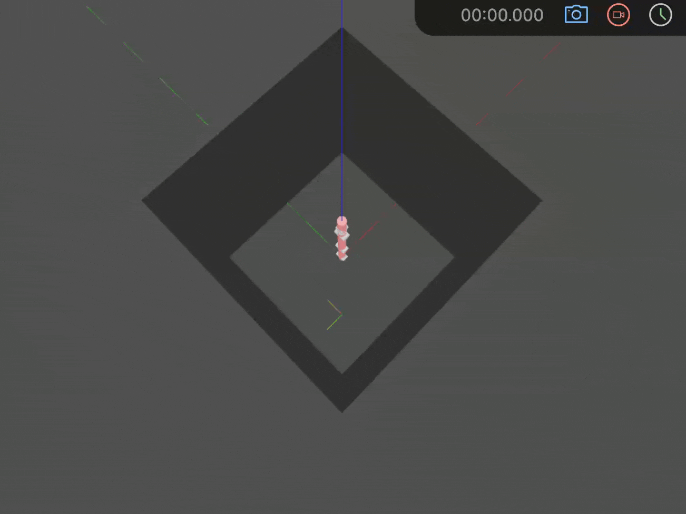
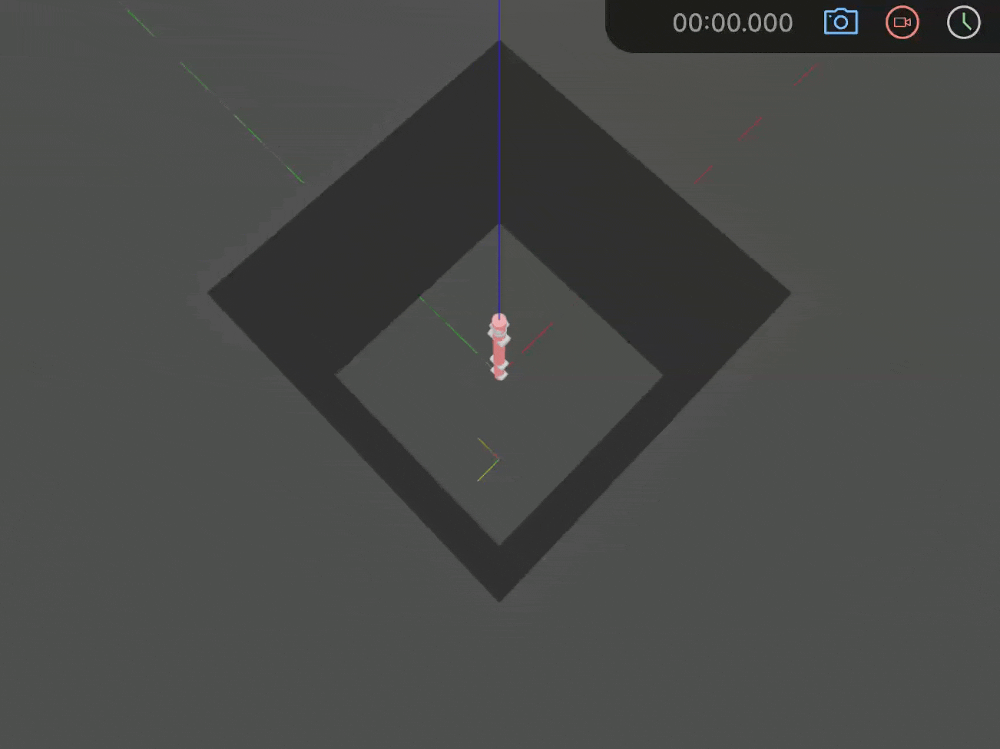
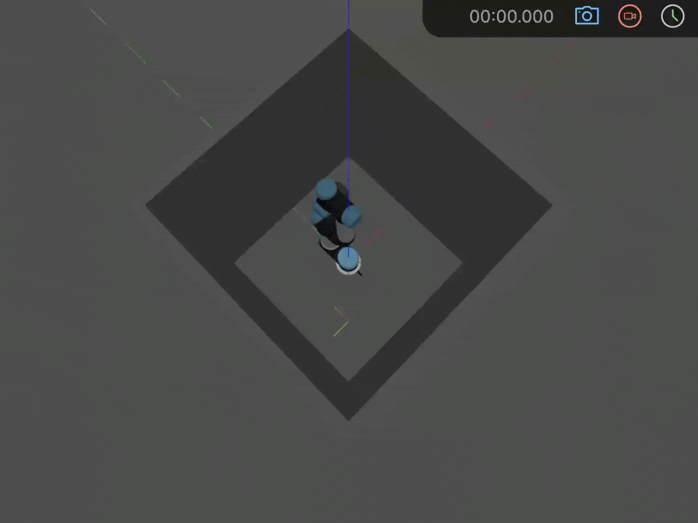

## Supplementary Materials (Anonymous)

### Use Case B

- [Optimization of P1](docs/optimization_p1.html)

Code-enriched literature of optimization problem P1:

$$
\min_{\mathbf{a}, \mathbf{d}}\quad f_{1}(\mathbf{a}, \mathbf{d}; \boldsymbol{\alpha^0}) = \delta
$$

- [Optimization of P2](docs/optimization_p2.html)

Code-enriched literature of optimization problem P2:

$$
\min_{\mathbf{a}, \mathbf{d}}\quad f_{2}(\mathbf{a}, \mathbf{d}; \boldsymbol{\alpha^0}) = \delta - G_{n}
$$

- [P1 RRT](docs/example_rrt_p1.html)

Example of robot P1 reaching a target using RRT.

- [P2 RRT](docs/example_rrt_p2.html)

Example of robot P2 reaching a target using RRT.

- [UR5 RRT](docs/example_rrt_ur5.html)

Example of UR5 reaching a target using RRT.

- [Compare Gₙ and δ](docs/table_iv.html)
Python script to generate Table IV in the paper.

- [Compare RRT Performance](docs/table_v.html)
Python script to generate Table V in the paper.
