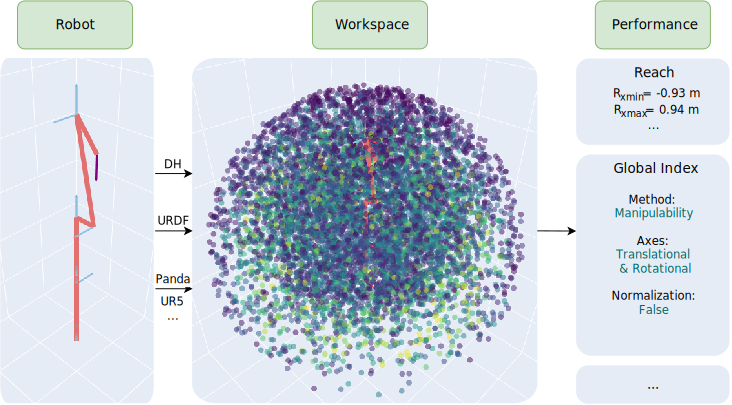

## Supplementary Materials (Anonymous)

### Use Case B

1. [Optimization of P1](docs/optimization_p1.html)

Code-enriched literature of optimization problem P1:
$$
\text{(P1)}\quad \min_{\mathbf{a}, \mathbf{d}}\quad f_{1}(\mathbf{a}, \mathbf{d}; \boldsymbol{\alpha^0}) = \delta
$$

2. [Optimization of P2](docs/optimization_p2.html)

Code-enriched literature of optimization problem P1:
$$
\text{(P2)}\quad \min_{\mathbf{a}, \mathbf{d}}\quad f_{2}(\mathbf{a}, \mathbf{d}; \boldsymbol{\alpha^0}) = \delta - G_{n}
$$

3. [Table IV](docs/table_iv.html)
Python script to generate Table IV in the paper.

4. [Table V](docs/table_v.html)
Python script to generate Table V in the paper.
